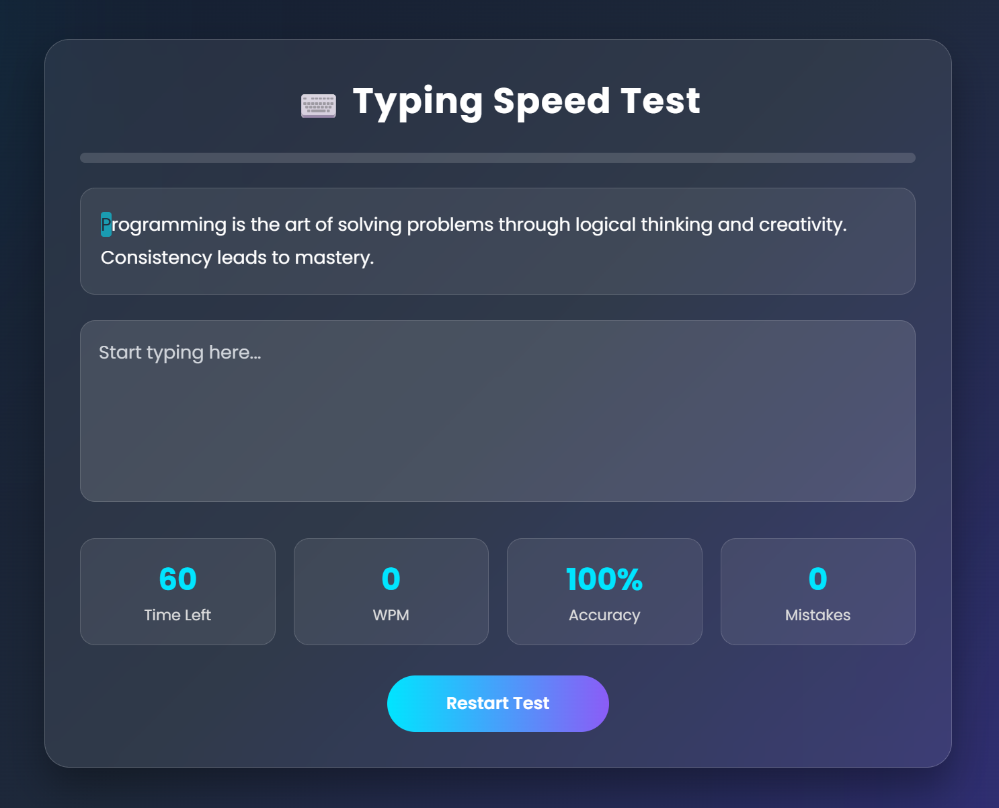

# ⌨️ Typing Speed Test

A modern Typing Speed Test built with HTML, CSS and JavaScript.

## 🚀 Features

- Random Paragraph Generator
- Live WPM Calculation
- Accuracy Percentage
- Mistake Counter
- 60-Second Timer
- Character Highlighting
- Progress Bar
- Glassmorphism UI
- Responsive Design

## 🛠️ Technologies Used

- HTML5
- CSS3
- JavaScript

## 📸 Screenshot

## ▶️ Run Locally

1. Clone the repository
2. Open the folder in VS Code
3. Install the Live Server extension
4. Right-click `index.html` → **Open with Live Server**